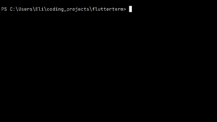
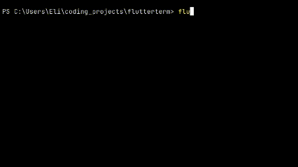
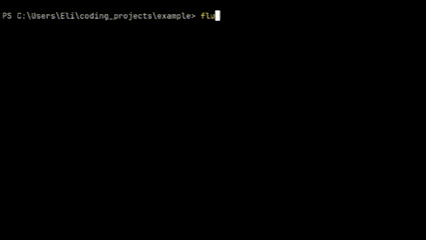

# Flutterterm: A Flutter CLI Wrapper

**Flutterterm** is a convenient CLI wrapper for running Flutter commands.

## Inspiration

The flutter cli is annoying to use when you need to manage things like 
environment variables, or launch on multiple emulators.

The current best tool, flutter-tools.nvim (amazing) works really well, but I 
prefer to just use the cli to run my flutter project.

flutter-tools.nvim has a nice way to make pre-set configurations, but is limited
to running inside neovim, which I have found to be inconvenient. For example, 
logs are not colored, and if neovim needs to be restarted, any running apps
must be terminated.

This tool aims to add functionality directly to the flutter cli tool by creating
a more interactive way to use it. If you've ever needed to manage different 
run configurations, then this tool can help. Simply add a configuration file 
to the root of your flutter project, and quickly run multiple project 
configurations.

## Usage

A configuration file is **not required**, but it is recommended to get the most out of this tool.  

To set up a configuration file, create a `.fterm_config.json` file in the root directory of your Flutter project. 
Flutterterm will look for this file when you run commands.

### Without a Configuration File

If you choose not to use a configuration file, Flutterterm will act as if it is executing:
```flutter run```

### Example `.fterm_config.json` File

```json
[
    {
        "name": "Dev",
        "mode": "debug",
        "flavor": "dev",
        "target": "main.dart",
        "dart_define_from_file": "file.json"
    },
    {
        "name": "Prod",
        "mode": "release",
        "flavor": "prod",
        "target": "main.dart"
    }
]
```

### **Configuration Fields**

- **`name`**: The name of the configuration.
- **`mode`**: The mode to run your app in (`debug`, `release`, or `profile`).
- **`flavor`**: The flavor to use (equivalent to `--flavor`).
- **`target`**: The target file to run (`-t` or `--target`). Defaults to `main.dart` if not specified.
- **`dart_define_from_file`**: Defines environment variables from a file (equivalent to `--dart-define-from-file`).


### **Running Commands**

### **flutterterm emulators**
```bash
// Start an existing emulator
flutterterm emulators
```


```bash
// Create a new emulator
flutterterm emulators create
```



####  **flutterterm run**
This command wraps the ```flutter run``` command
```bash
flutterterm run
```

